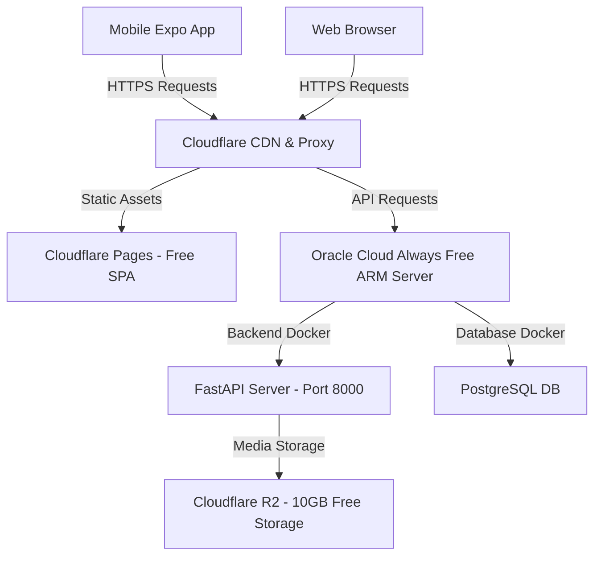

# Cost-Effective Hosting Strategy: Matrimony Application

A comprehensive guide to hosting the **Matrimony Web & Mobile App** (Expo / React Native Frontend + FastAPI Python Backend + PostgreSQL Database) with the lowest possible monthly cost (starting from **$0/month**).

---

## 🏗️ Application Component Breakdown

| Component | Technology | Target Deployment |
| :--- | :--- | :--- |
| **Web Frontend** | React Native Web / Expo SPA | Static HTML/JS CDN |
| **Mobile Frontend** | React Native Expo | Expo EAS (APK/AAB/IPA builds) / App Stores |
| **Backend API** | FastAPI + Uvicorn | Containerized Docker / Linux VPS / PaaS |
| **Database** | PostgreSQL | Managed Postgres / Self-hosted Postgres Docker |
| **Photo Uploads** | Static Files / Media | S3-compatible Object Storage |

---

## 🏆 Top Recommended Hosting Architectures

### Option 1: The "100% Free Forever" Stack (Best Overall Value)

> [!TIP]
> **Total Monthly Cost: $0.00 / month**
> Ideal for initial launch, MVP, testing, and early production without any cloud infrastructure bill.



#### Breakdown:
1. **Web Frontend**: **Cloudflare Pages** or **Vercel** (`$0/month`)
   - Unlimited bandwidth, free SSL, global CDN edge caching.
   - Build output: `dist/` directory from `npx expo export --platform web`.
2. **Backend API & Database**: **Oracle Cloud Infrastructure (OCI) Always Free Tier** (`$0/month`)
   - **Specs**: 4 ARM vCPUs, 24 GB RAM, 200 GB Storage, 10 TB/month outbound bandwidth free forever.
   - Run existing `docker-compose.yml` (`web` + `db`) on the free OCI Ampere A1 Compute Instance.
3. **User Photos & Media Storage**: **Cloudflare R2** (`$0/month`)
   - 10 GB free storage per month with **$0 egress bandwidth fees** (unlike AWS S3 which charges for downloads).
4. **Mobile App Build**: **Expo EAS Build** (`$0/month`)
   - Free tier includes 30 Android builds and 30 iOS builds per month.

---

### Option 2: Managed Serverless / PaaS Stack (Zero Server Maintenance)

> [!NOTE]
> **Total Monthly Cost: $0.00 to $7.00 / month**
> Ideal if you don't want to manage Docker containers, OS updates, or Linux sysadmin tasks.

| Service | Cloud Provider | Free Quota / Cost | Notes |
| :--- | :--- | :--- | :--- |
| **Database** | **Neon.tech** or **Supabase** | **$0/month** (500 MB Postgres free) | Fully managed Postgres with auto-backups. |
| **Backend API** | **Render.com** or **Koyeb** | **$0 to $7/month** | Render Web Service (Starter Plan $7/mo for zero sleep mode). |
| **Web Frontend** | **Vercel** / **Cloudflare Pages** | **$0/month** | Global CDN deployment. |
| **Photo Storage** | **Cloudflare R2** | **$0/month** | 10 GB free object storage. |

---

### Option 3: Single Budget VPS (Simplest Dedicated Setup)

> [!IMPORTANT]
> **Total Monthly Cost: ~$4.50 / month (Hetzner) or $5.00 / month (DigitalOcean / Linode)**
> Ideal for ultra-high performance with predictable low flat monthly pricing.

- **Hetzner Cloud (CX22 Instance)**:
  - **Specs**: 2 vCPUs, 4 GB RAM, 40 GB NVMe SSD, 20 TB Traffic.
  - **Cost**: ~€3.80 / month (~$4.15 USD).
  - Simply clone both repos, run `docker compose up -d`, and point Nginx + Certbot (Free SSL) to your domain.

---

## 📊 Detailed Cloud Comparison Matrix

| Cloud Provider | Monthly Cost (Production) | Setup Complexity | Scalability | Recommended For |
| :--- | :--- | :--- | :--- | :--- |
| **Oracle Cloud (OCI)** | **$0.00** | Medium (Docker on VPS) | High (24GB RAM free) | **Best Overall Budget Choice** |
| **Cloudflare + Neon + Render** | **$0.00 - $7.00** | Low (Git push deploy) | High (Auto-scaled PaaS) | **Zero Sysadmin Maintenance** |
| **Hetzner Cloud** | **~$4.15** | Medium (Nginx + Docker) | Extremely High | **Lowest Paid Dedicated VPS** |
| **AWS (Lightsail / EC2)** | **~$10.00 - $25.00** | High | Maximum | Enterprise / AWS Ecosystem |
| **GCP / Azure** | **~$15.00 - $30.00** | High | Maximum | Enterprise Teams |

---

## 🚀 Step-by-Step Production Deployment Checklist

### Step 1: Deploy Web Frontend (Cloudflare Pages)
1. In `Matrimony-APP-Frontend`:
   ```bash
   npx expo export --platform web
   ```
2. Link your GitHub repo `itsmethahseer/Matrimony-APP-Frontend` to **Cloudflare Pages**.
3. Build Settings:
   - **Framework Preset**: None / Static Site
   - **Build Command**: `npm install && npx expo export --platform web`
   - **Build Output Directory**: `dist`
4. Set Environment Variables:
   - `EXPO_PUBLIC_API_URL`: `https://api.yourdomain.com`

---

### Step 2: Deploy Backend & Database (Oracle Cloud or Hetzner VPS)
1. Provision a free **Ubuntu 24.04 ARM instance** on Oracle Cloud.
2. Install Docker & Docker Compose:
   ```bash
   sudo apt update && sudo apt install -y docker.io docker-compose-v2
   ```
3. Clone backend & start services:
   ```bash
   git clone git@github.com:itsmethahseer/Matrimony-APP-Backend.git
   cd Matrimony-APP-Backend
   docker compose up -d --build
   ```
4. Run database seed / migrations:
   ```bash
   docker compose exec web python seed.py
   ```
5. Install Nginx & Certbot for Free SSL:
   ```bash
   sudo apt install -y nginx certbot python3-certbot-nginx
   sudo certbot --nginx -d api.yourdomain.com
   ```

---

### Step 3: Build & Publish Mobile App (Expo EAS)
1. Install EAS CLI:
   ```bash
   npm install -g eas-cli
   ```
2. Log in to Expo:
   ```bash
   eas login
   ```
3. Initialize EAS build:
   ```bash
   eas build:configure
   ```
4. Build standalone Android APK / AAB:
   ```bash
   eas build -p android --profile preview
   ```

---

## 💡 Summary Recommendation

1. **Start with Option 1 (Oracle Cloud Always Free + Cloudflare Pages + R2)**. It costs **$0.00/month** while giving you 24GB RAM and 4 ARM cores.
2. **Use Cloudflare R2** instead of AWS S3 for user photo uploads to avoid bandwidth egress charges.
3. **Use Expo EAS Build** (Free Tier) to compile `.apk` files for mobile distribution.
